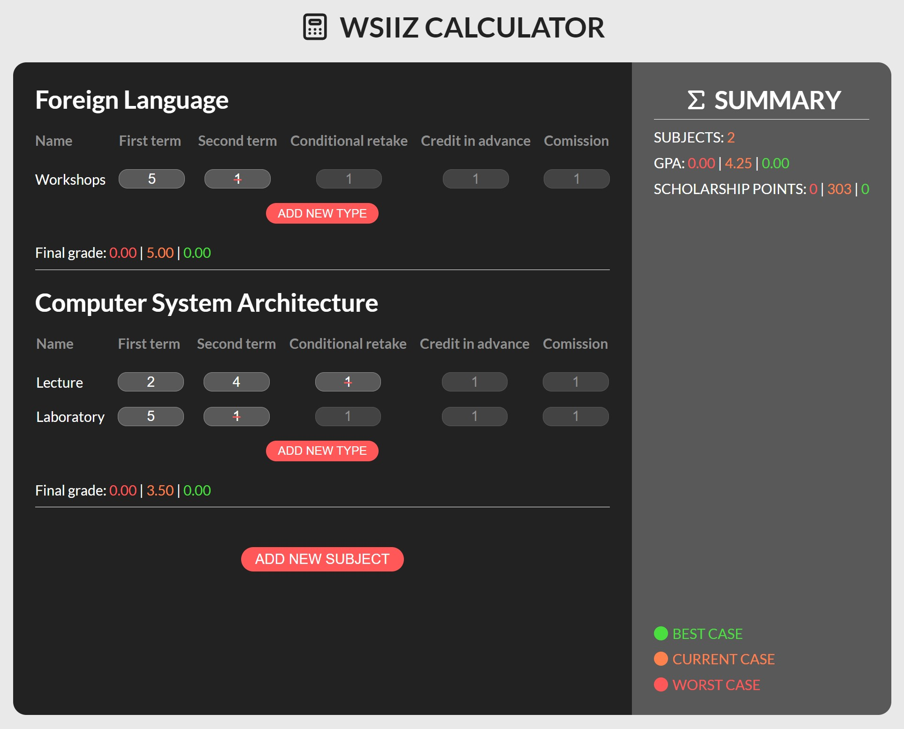

# WSIiZ-Calculator

Calculator which counts the average GPA of any singular subject, overall GPA and scholarship points.

## How it looks

## Main functionality

<ul>
   <li><b>Subjects:</b></li>
   <ul>
      <li>Create</li>
      <li>Delete</li>
      <li><b>Types:</b></li>
      <ul>
         <li>Add</li>
         <li>Delete</li>
         <li><b>Grades:</b></li>
         <ul>
            <li>Add</li>
            <li>Edit</li>
            <li>Delete <i>(if "1" it doesn't count to gpa)</i></li>
         </ul>
      </ul>
      <li>Final grade</li>
   </ul>
   <li><b>Summary:</b></li>
   <ul>
      <li>Subjects count</li>
      <li>Grade Point Average</li>
      <li>Scholarship points</li>
   </ul>
</ul>
*At this moment it only counts current case, but other cases will be added in the future!*

## Tech stack

This project is created with:   

-  HTML
-  CSS
-  JavaScript
-  React.js

## Installation

### `npm start`

Runs the app in the development mode.\
Open [http://localhost:3000](http://localhost:3000) to view it in your browser.

The page will reload when you make changes.\
You may also see any lint errors in the console.

### `npm test`

Launches the test runner in the interactive watch mode.\
See the section about [running tests](https://facebook.github.io/create-react-app/docs/running-tests) for more information.

### `npm run build`

Builds the app for production to the `build` folder.\
It correctly bundles React in production mode and optimizes the build for the best performance.

The build is minified and the filenames include the hashes.\
Your app is ready to be deployed!

See the section about [deployment](https://facebook.github.io/create-react-app/docs/deployment) for more information.
